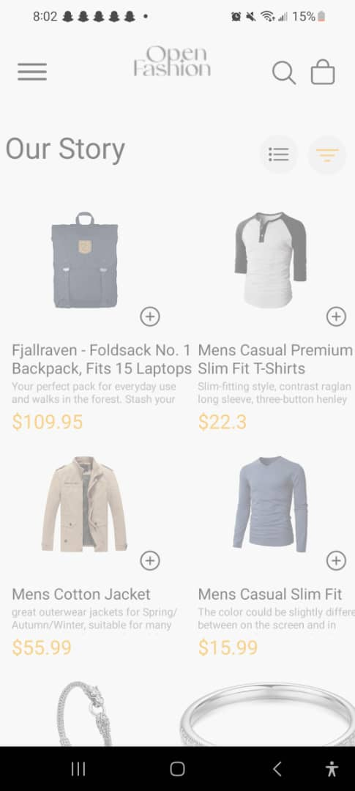
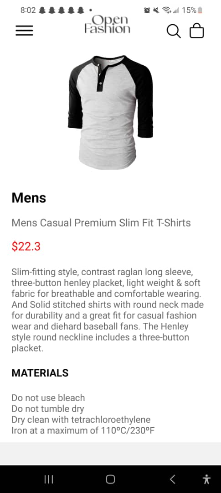

# rn-assignment7-11315992

React Native UI mockup using Expo. It includes external links and utilizes storage systems.

# Fashion App

This project is a mobile application UI mockup for a fashion store, created with React Native. It features product listings, detailed product views, and a shopping cart.

## Features

- **Product Listing:** Retrieves products from the Fake Store API and displays them in a grid layout.
- **Product Detail:** Provides detailed information about a selected product.
- **Shopping Cart:** Allows users to add products to the cart and view them in a dedicated cart screen.
- **Drawer Navigation:** Custom drawer navigation for easy section access.

## Usage

- **Home Screen:** Shows a list of products fetched from the API. Tapping a product opens its detail view.
- **Product Detail Screen:** Displays detailed information about the chosen product and includes an option to add it to the cart.
- **Cart Screen:** Lists products added to the cart.

## Project Structure

- **`/assets`**: Contains image assets used in the app.
- **`/components`**: Contains reusable UI components.
- **`/screens`**: Contains the main screens (Home, ProductDetail, CartScreen).

## Dependencies

- **React Navigation:** Manages navigation and drawer.
- **React Native Gesture Handler:** Handles gestures.
- **React Native Reanimated:** Manages animations.
- **AsyncStorage:** Stores cart data locally.

## Screenshots

 
 
 
